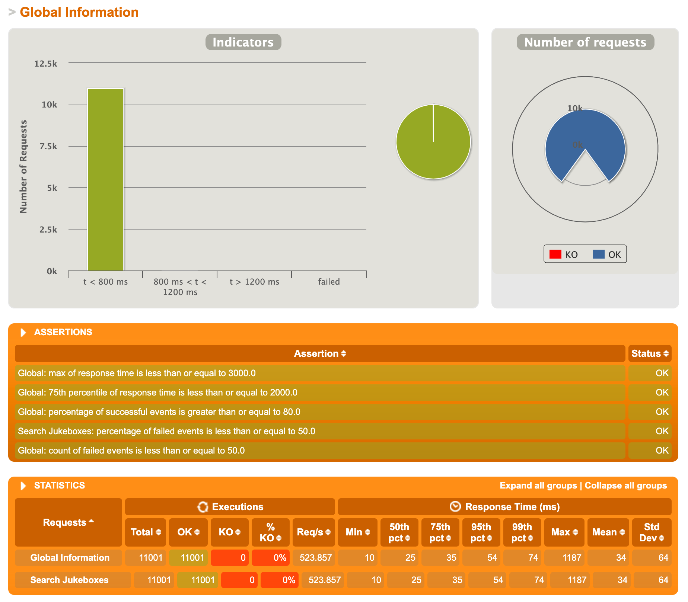
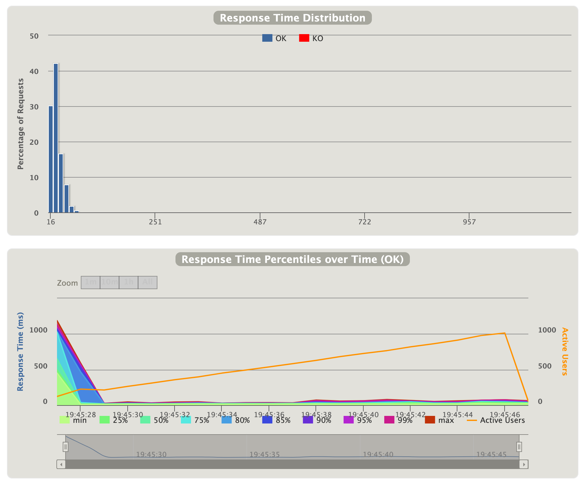

# Jukebox Settings API

   

Web application to remote control Jukebox settings.  
Depending on what components (hardware modules) a jukebox has, it may or may not support a setting.

📎 You can find an <u> **Online** </u> version :

- On-premises : [Here](http://jukeboxsettings.myitworld.fr/swagger-ui.html) 🔥
- Cloud (AWS) : [Here](http://jukeboxconfig-env.eba-qxpgunxb.eu-west-3.elasticbeanstalk.com/swagger-ui.html) ☁️

(Please if you cannot reach the service, [Contact me](mailto:imad.salki@hotmail.fr?subject=[GitHub]%20Jukebox%20Service)
✉️ )

# Launch the App 🎉

* ### 💻 __Local version__ :

    1. ### Install

      mvn clean install

    2. ### Run the app

      java -jar target/juckboxSettings-*.jar

  🕵️ _When you run the tests, you can find the reports (Test Coverage...) in `target/site/jacoco`_

* ### 🐳 __Docker version :__

    1. ### Build the Image

      mvn clean install && docker build -t theoctavegroup/jukeboxsetting:latest .

    2. ### Deploy the container and expose it on port 8080

      docker run -d --name jukeboxsetting -p 8080:8080 theoctavegroup/jukeboxsetting

# REST API ⚙️

The jukeboxSettings REST API described below.

## Get Application API Docs ( Swagger ) 📖

UI version :

`http://localhost:8080/swagger-ui.html`

Json format :

`http://localhost:8080/v2/api-docs`

## Get list of Jukebox supported by setting and filtered by Model 📜

### Request ⬆️

`GET /getJukeboxes`

    curl -i -H 'Accept: application/json' -d 'settingId=Foo' http://localhost:8080/getJukeboxes?settingId=12345

### Response ⬇️

    HTTP/1.1 200 OK
    Date: Sun, 30 May 2021 04:44:55 GMT
    Status: 200 OK
    Connection: close
    Content-Type: application/json

    []

## Get Application Health and Information 🩺

### Request ⬆️

`GET /actuator`

    curl -i -H 'Accept: application/json' http://localhost:8080/actuator/health

### Response ⬇️

    HTTP/1.1 200 OK
    Date: Sun, 30 May 2021 04:44:55 GMT
    Status: 200 OK
    Connection: close
    Content-Type: application/json

    {
        "status": "UP"
    }

# Stress Test Results 📊

### 🗄 Server Config (On-Premise) :

- OS  : Ubuntu Server 20.04
- CPU : i5-4460
- RAM : 12Go

    

    

